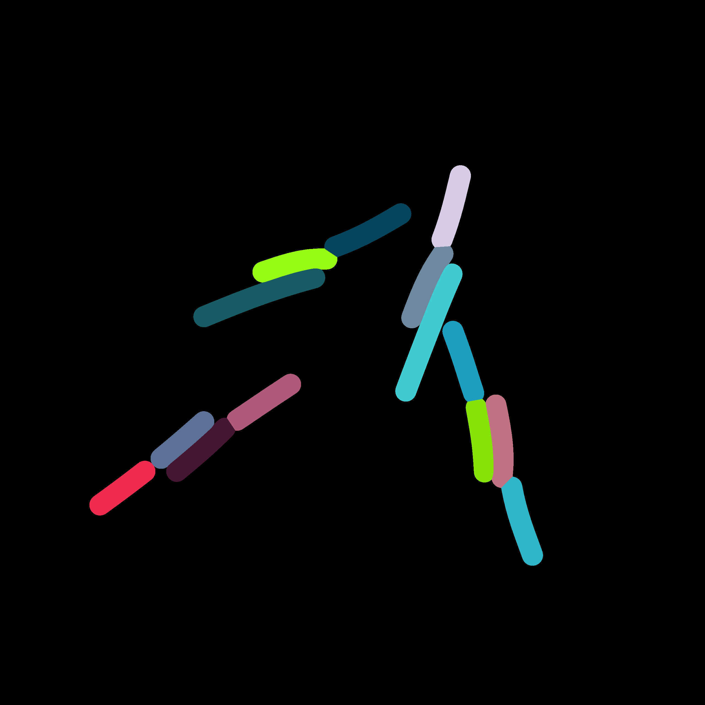
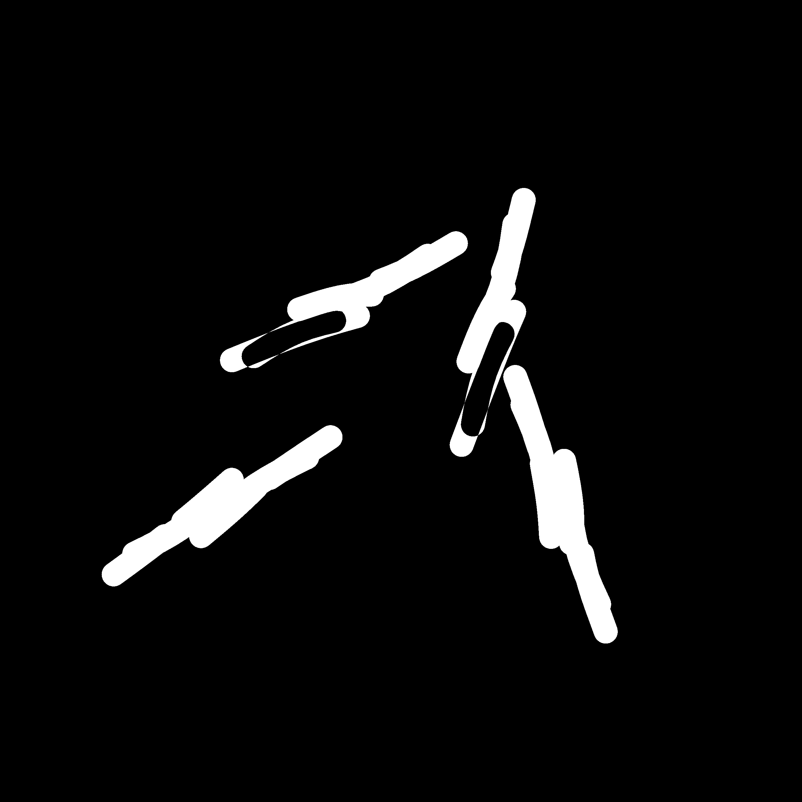
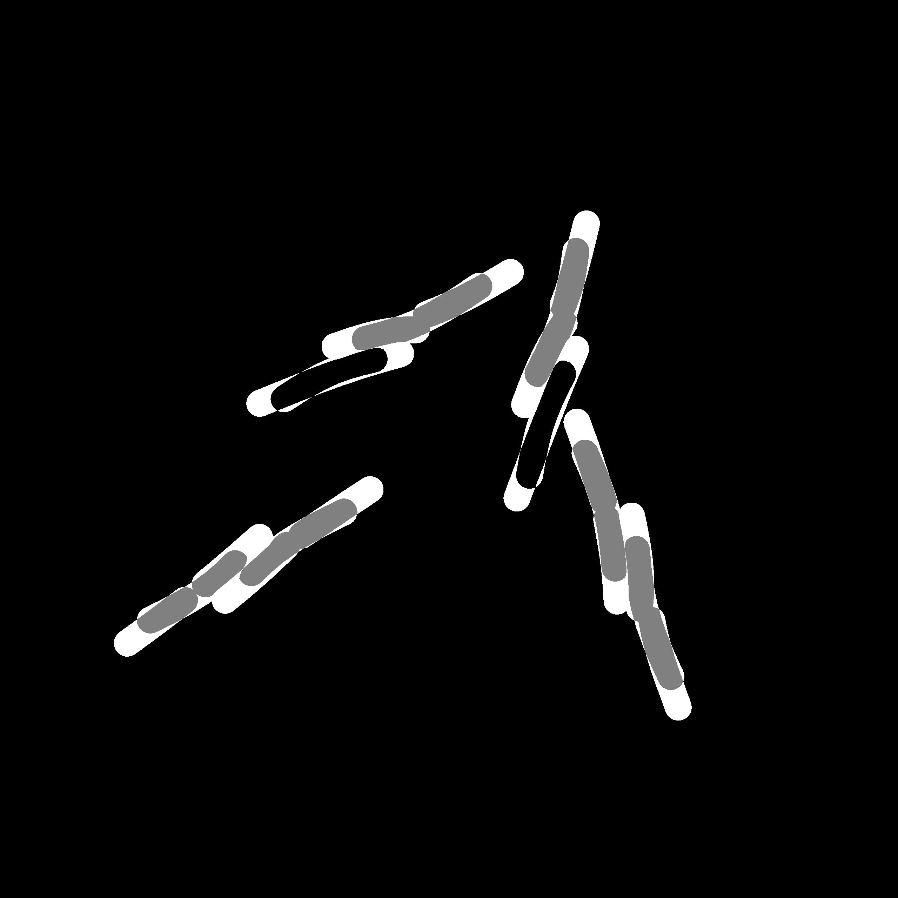

Fitting Methods
===============

Snapshots at `t=20min` and `t=40min`.
All cells have divided.

Calculations of differences between the images.
The first image purely calculates the differing area while the second approach also takes into
account if cells are related and weighs this specific overlapping area less.
