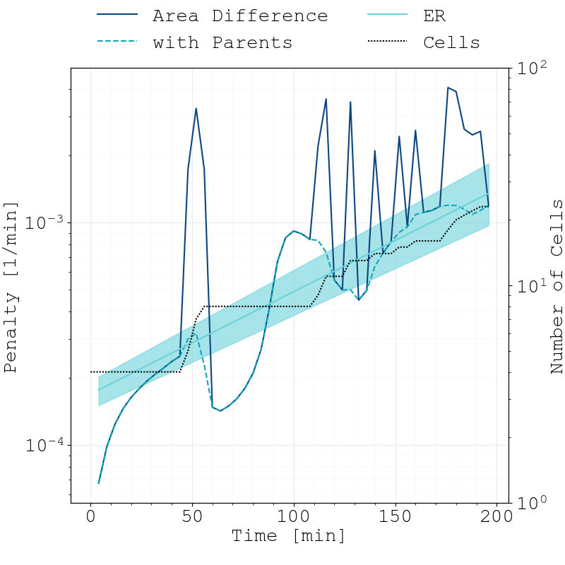

Fitting-Methods
===============

Extracting Positions from Masks
-------------------------------

.. subfigure:: ABC
    :layout-sm: A|B|C
    :gap: 8px
    :subcaptions: below
    :class-grid: outline

    .. image:: _static/fitting-methods/extract_positions-001800.png
    .. image:: _static/fitting-methods/extract_positions-005800.png
    .. image:: _static/fitting-methods/extract_positions-009800.png

    Instance-level cell masks of a simulation run starting with 4 agents.
    The positions associated to the individual cell agents which have been estimated by our fitting
    process are displayed with dark crosses while the segments which actually constitute the cell
    are displayed as a contiguous bright line.

We provide an extraction algorithm which utilizes instance-level cell masks and extracts the
positions of the cells in the form of individual vertices.
It works in multiple states:

1. Calculate individual mask segments for cells
2. Skeletonize cell-mask :cite:`Lee1994`
3. Sort points along major axis
4. Calculate evenly-spaced segments along points, thus obtaining vertices (see :ref:`Model <model>`).

In particular, this algorithms fails if for any reason, multiple start or end points were
identified.

To quantify the effectiveness of this extraction algorithm, we compare the average rod lengths of
the known simulated agent and teh eestiamted positions with each other.
Furthermore, we calculated the average difference per vertex between the simulated position and
the estimated one.
The next figure shows this evaluation for the above presented time series.

.. figure:: _static/fitting-methods/displacement-calculations.png

    We can clearly see that the fitting method slightly underestimates the total rod length.
    This can be attributed to the Skelezonization algorithm :cite:`Lee1994` which truncates the ends
    of the point set more.
    As time increases, our fitting method becomes less accurate.
    However, overall slopes and division events are still captured correctly.
    This behaviour is due non-trivial geometries of the cell which makes it harder to properly
    estimate the approximating polygon.

Constucting a Cost Function
---------------------------

- Talk about how to measure differences between masks

.. subfigure:: AB
    :layout-sm: A|B
    :gap: 8px
    :subcaptions: below
    :class-grid: outline

    .. image:: _static/fitting-methods/progressions-1.png
    .. image:: _static/fitting-methods/progressions-2.png

    Snapshots at `t=40min` and `t=60min`.
    All cells have undergone a division event.

.. subfigure:: AB
    :layout-sm: A|B
    :gap: 8px
    :subcaptions: below
    :class-grid: outline

    .. image:: _static/fitting-methods/progressions-3.png
    .. image:: _static/fitting-methods/progressions-4.png

    Calculations of differences between the images.
    The first image purely calculates the differing area while the second approach also takes into
    account if cells are related and weighs this specific overlapping area less.

   We performed penalty calculations for successive simulation snapshots with two different
   techniques.
   Due to the overall exponential growth of the ensemble, we also expect an exponential difference
   (its derivative) reported by our implemented methods as time increases.
   We can clearly see that cell-division introduces undesirable spikes between individual
   time-steps when not accounting for cell-lineage.
   When weighing differences between daughter and parent-cells with a penalty of :math:`p=0`, these
   enormous spikes are regularized.
