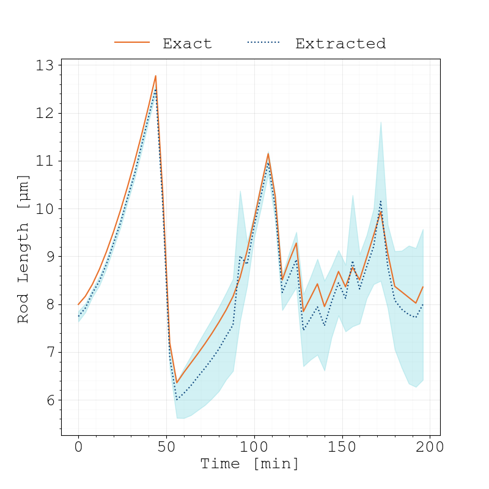

Fitting-Methods
===============

Extracting Positions from Masks
-------------------------------

.. subfigure:: ABC
    :layout-sm: A|B|C
    :gap: 8px
    :subcaptions: below
    :class-grid: outline

    .. image:: _static/fitting-methods/extract_positions-001800.png
    .. image:: _static/fitting-methods/extract_positions-005800.png
    .. image:: _static/fitting-methods/extract_positions-009800.png

    Instance-level cell masks of a simulation run starting with 4 agents.
    The positions associated to the individual cell agents which have been estimated by our fitting
    process are displayed with dark crosses while the segments which actually constitute the cell
    are displayed as a contiguous bright line.

We provide an extraction algorithm which utilizes instance-level cell masks and extracts the
positions of the cells in the form of individual vertices.
It works in multiple states:

1. Calculate individual mask segments for cells
2. Skeletonize cell-mask :cite:`Lee1994`
3. Sort points along major axis
4. Calculate evenly-spaced segments along points, thus obtaining vertices (see :ref:`Model <model>`).

In particular, this algorithms fails if for any reason, multiple start or end points were
identified.

To quantify the effectiveness of this extraction algorithm, we compare the average rod lengths of
the known simulated agent and teh eestiamted positions with each other.
Furthermore, we calculated the average difference per vertex between the simulated position and
the estimated one.
The next figure shows this evaluation for the above presented time series.

    We can clearly see that the fitting method slightly underestimates the total rod length.
    This can be attributed to the Skelezonization algorithm :cite:`Lee1994` which truncates the ends
    of the point set more.
    As time increases, our fitting method becomes less accurate.
    However, overall slopes and division events are still captured correctly.
    This behaviour is due non-trivial geometries of the cell which makes it harder to properly
    estimate the approximating polygon.

Constucting a Cost Function
---------------------------

The previously explained extraction algorithm allows us to obtain positional information in the form
of the cells vertices.
These vertices can also be used for parameter estimation purposes, by simply applying any chosen
distance metric.
However, in the case when the bacteria divide, the direct comparison of extracted and simulated
vertices fails, since particular time points of the simulation or real data contain more/less cells
than the other.
This would require us to compare arrays of varying dimension.
However, we can circumvent this situation by following a different approach.
By synthetically generating instance-level cell masks, we can compare said masks to the experimental
ones.
We can now compare the synthetic and experimental image, assigning a penalty :math:`p` whenever two pixels
are not matching.
However we need to take into account if the cells associated with the respective color are related
to each other, by either one being daughter or mother of the other.
By assigning a reduced penalty :math:`p_p<p` in this case, we account for the fact that the cell in
question will divide, thus eventually producing a matching value, although the current timing may
not yet be appropriate (depending on the optimized scenario).
The differences which are calculated by this method are presented in the next figures.

.. subfigure:: AB
    :layout-sm: A|B
    :gap: 8px
    :subcaptions: below
    :class-grid: outline

    .. image:: _static/fitting-methods/progressions-1.png
    .. image:: _static/fitting-methods/progressions-2.png

    Two states of a system which are being compared to each other.
    The second snapshot contains 5 more cells due to additional division events.

.. subfigure:: AB
    :layout-sm: A|B
    :gap: 8px
    :subcaptions: below
    :class-grid: outline

    .. image:: _static/fitting-methods/progressions-3.png
    .. image:: _static/fitting-methods/progressions-4.png

    Calculations of differences between the images.
    The first image purely calculates the differing area while the second approach also takes into
    account if cells are related and weighs this specific overlapping area with a reduced penalty
    value :math:`p_p`.
