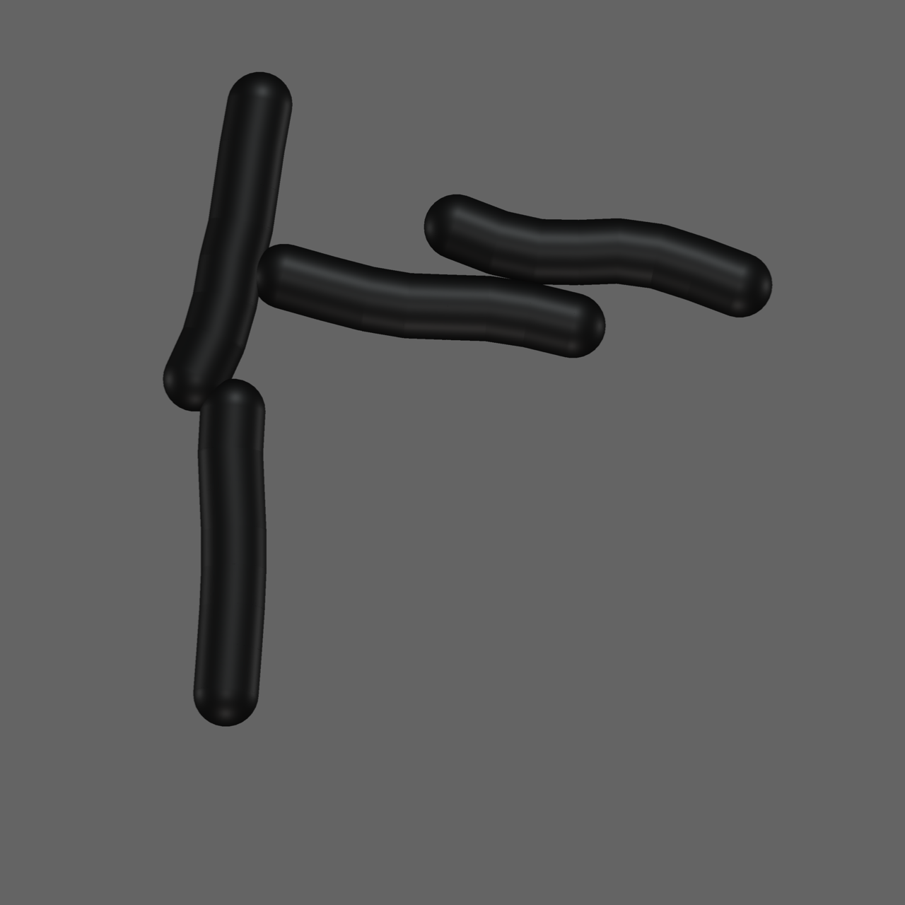
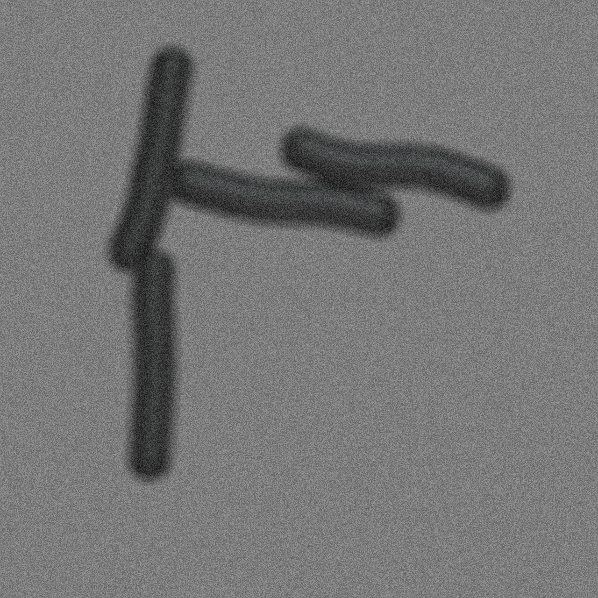
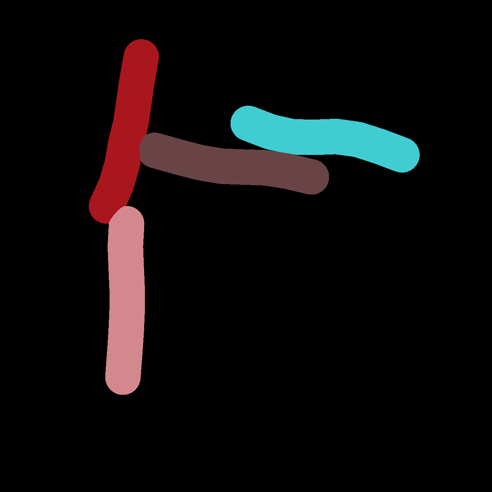
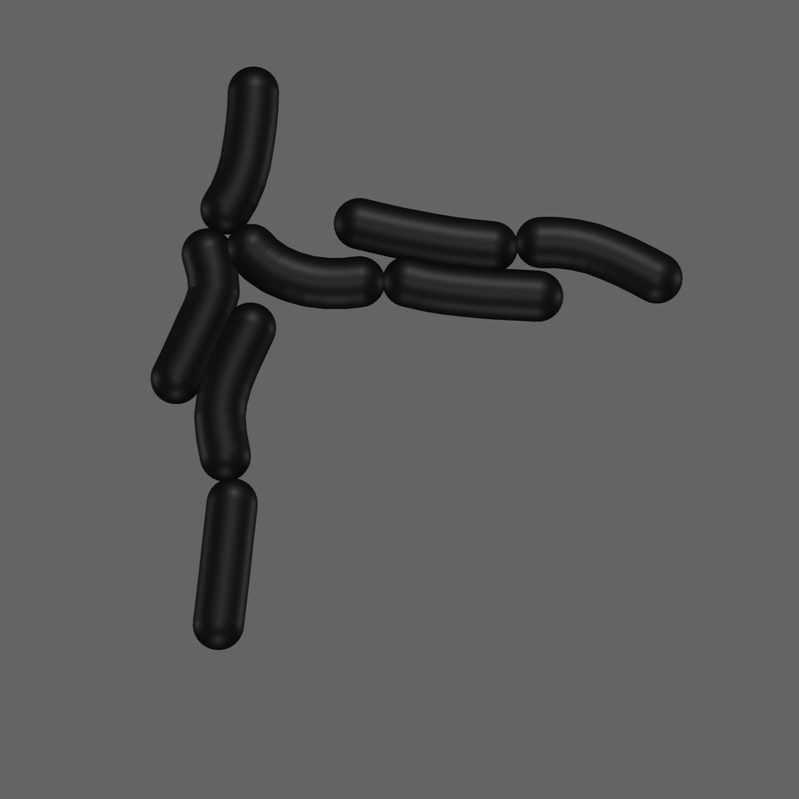
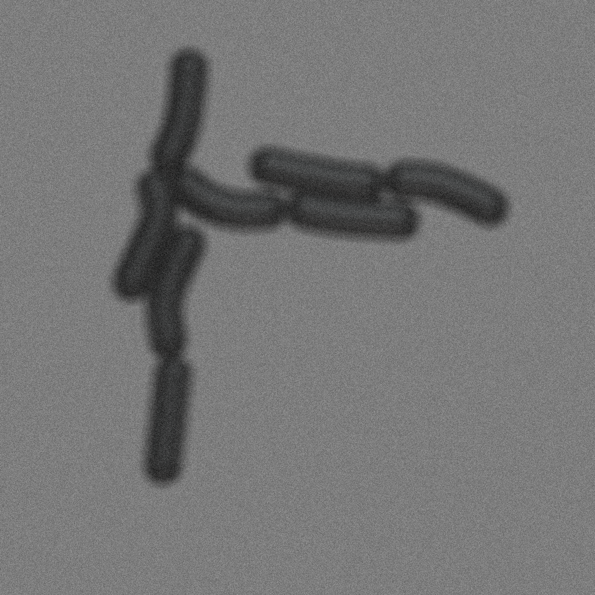
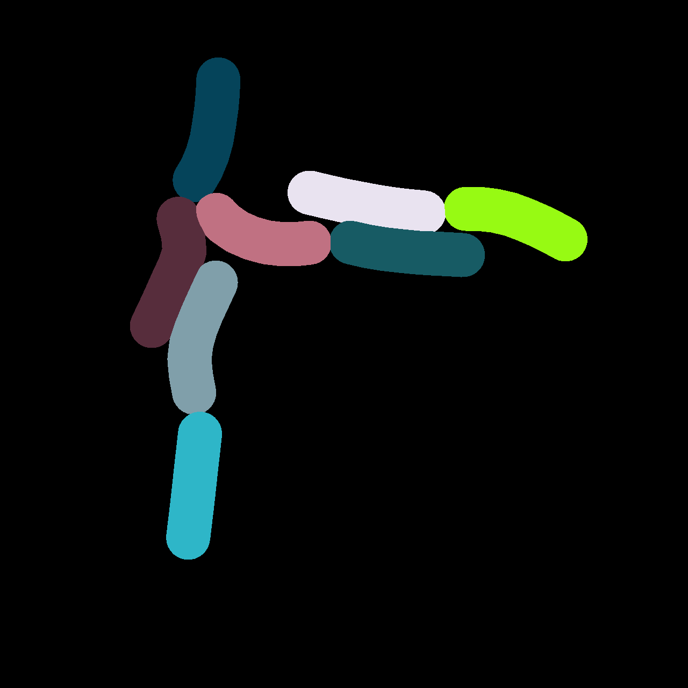
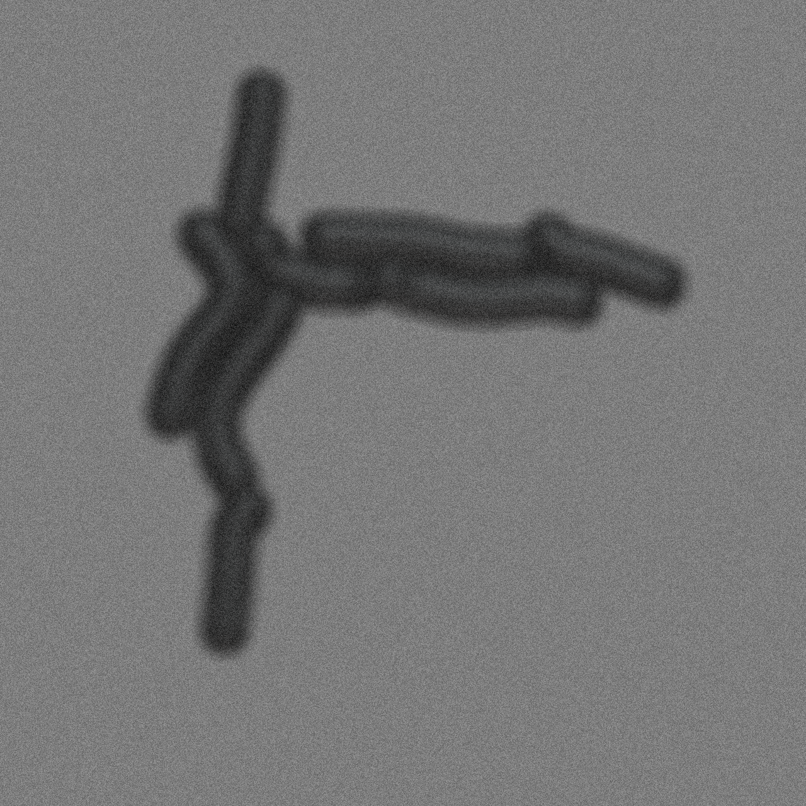

.. cr_mech_coli documentation master file, created by
   sphinx-quickstart on Tue Jul 30 00:53:55 2024.
   You can adapt this file completely to your liking, but it should at least
   contain the root `toctree` directive.

cr_mech_coli
############

.. image:: https://img.shields.io/github/license/jonaspleyer/cr_mech_coli\?style=flat-square
   :alt: GPLv2 License
.. image:: https://img.shields.io/github/actions/workflow/status/jonaspleyer/cr_mech_coli/CI.yml?style=flat-square
   :alt: Test Status
.. image:: https://img.shields.io/github/actions/workflow/status/jonaspleyer/cr_mech_coli/sphinx_doc.yml?style=flat-square
   :alt: Build Status

This package is centered around a mechanical model for rod-shaped bacteria such as `E.Coli`.

:ref:`Model <model>`
--------------------

The model is mechanistic and coarse-grained enough such that we can estimate its parameters from
even a small dataset.
Its low computational cost mean that it can be readily applied in the construction of other
Agent-Based Simulations within `cellular_raza <https://cellular-raza.com>`_
:cite:`Pleyer_cellular_raza_2023`.

:ref:`Image Generation <image-generation>`
------------------------------------------

We use `pyvista <https://pyvista.org/>`_ :cite:`Sullivan2019` to create a 3D image which contains
complex lighting and occlusion effects which would be harder to reproduce in a 2D plot.
Afterwards, defects are inserted with `opencv <https://opencv.org/>`_ to mimick effects such as
optical aberration, sensor noise or other imperfections which can be introduced by the measurement
device.

:ref:`Cell Segmentation <cell-segmentation>`
--------------------------------------------

The data generated by such simulations can be used to create labelled images which can then be used
to train deep-learning image-segmentation algorithms.
The quality of training data is dependent on our ability to reverse-engineer realistic microscopy
images from the generated simulation data.
We are planning to use `pytorch <https://pytorch.org>`_'s 'Faster R-CNN'
:cite:`https://doi.org/10.48550/arxiv.1506.01497` to tackle this task.

The images below show the steps outlined above.

Snapshots at `t=20min`.

Snapshots at `t=40min`.

.. image:: _static/06725850956850056874/masks/000000600.png
   :width: 30%

Snapshots at `t=60min`.

.. toctree::
   :maxdepth: 2
   :caption: Contents:
   :titlesonly:
   :hidden:

    Documentation <documentation/index>
    Model <model>
    Fitting Methods <fitting-methods>
    Imaging Generation <image-generation>
    Cell Segmentation <cell-segmentation>
    References <references>

Indices and tables
##################

* :ref:`genindex`
* :ref:`modindex`
* :ref:`search`

