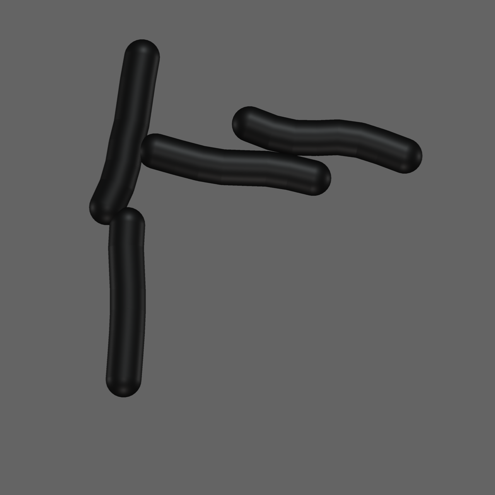
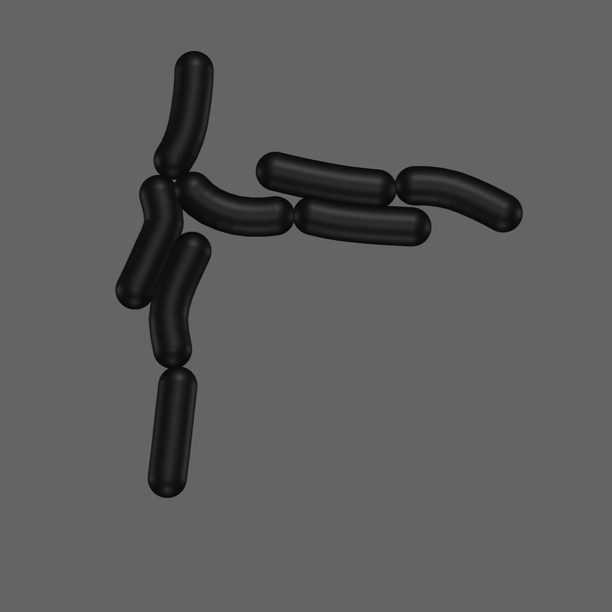
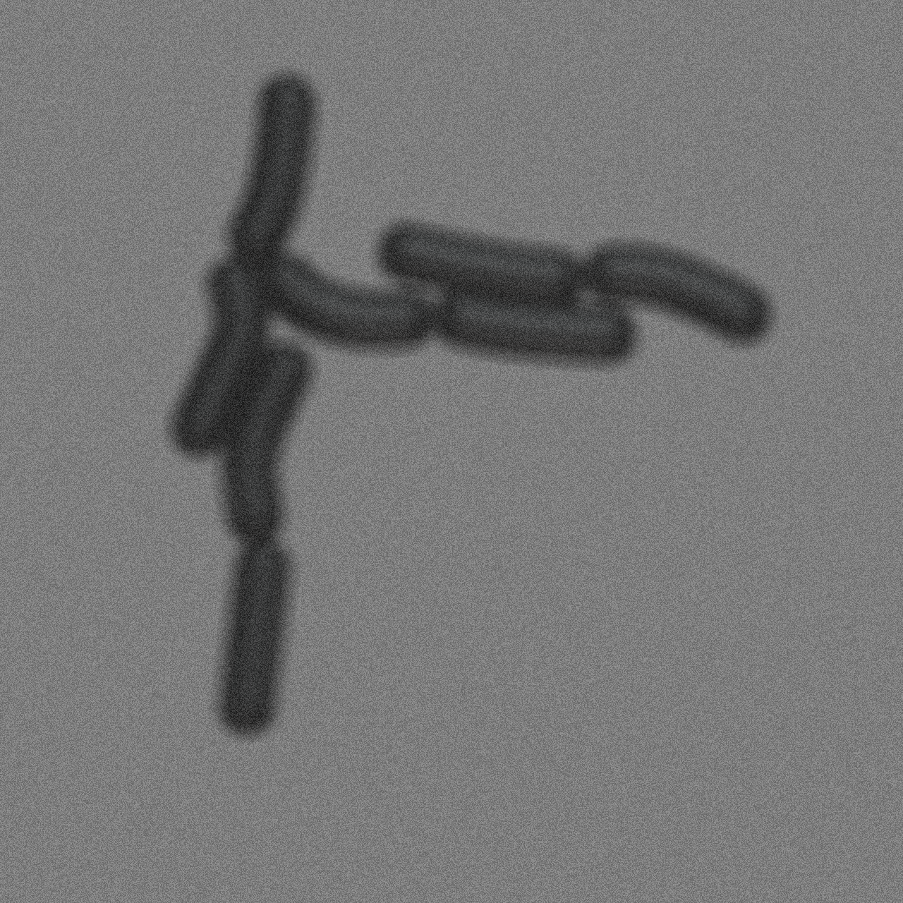
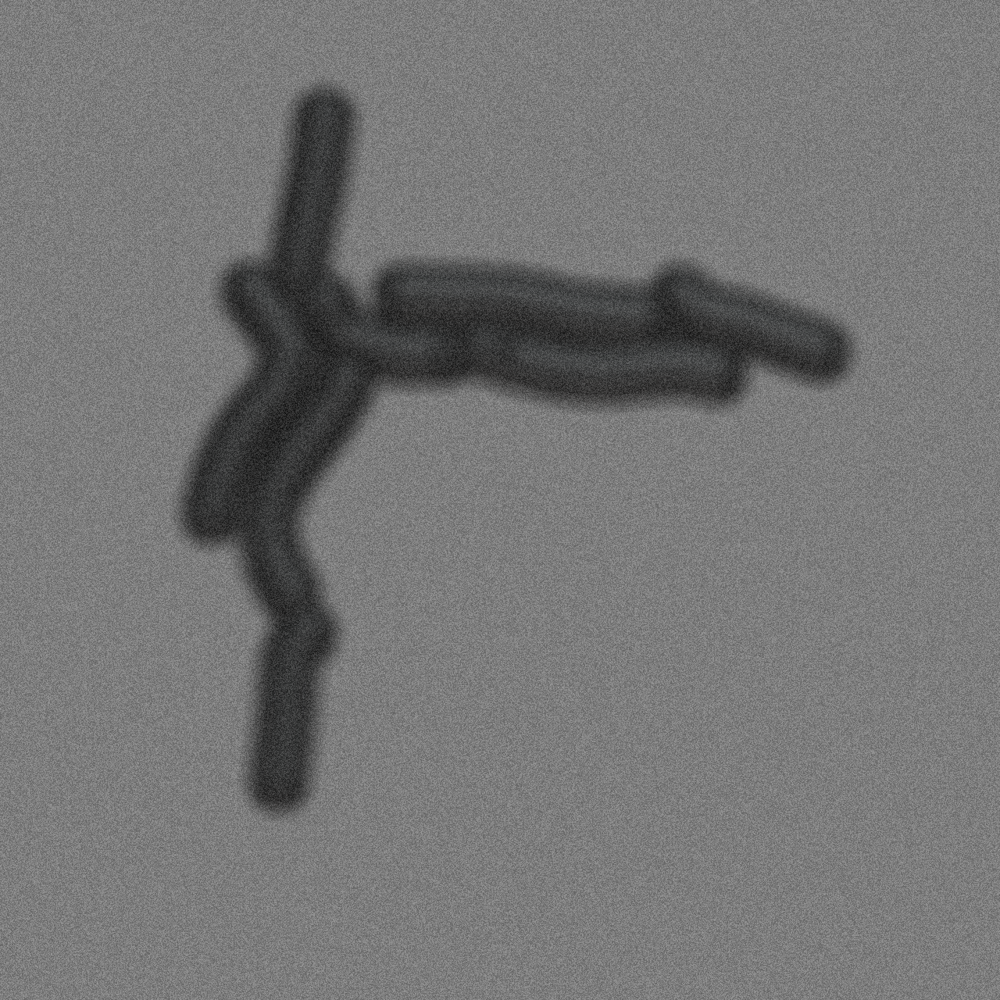
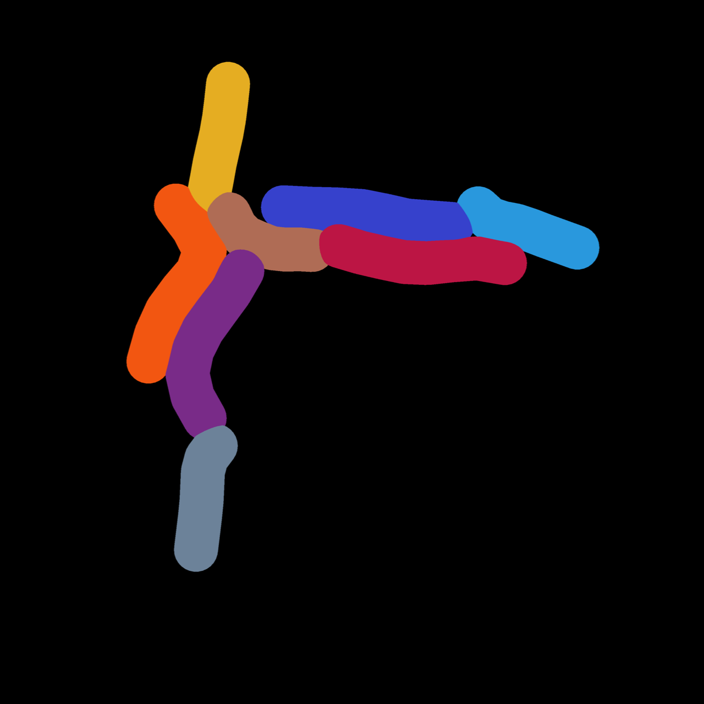

.. cr_mech_coli documentation master file, created by
   sphinx-quickstart on Tue Jul 30 00:53:55 2024.
   You can adapt this file completely to your liking, but it should at least
   contain the root `toctree` directive.

cr_mech_coli
============

This package is centered around a mechanical model for rod-shaped bacteria such as `E.Coli`.
The :ref:`model`

Snapshots at `t=20min`.

Snapshots at `t=40min`.

Snapshots at `t=60min`.

We combine functionalities from multiple packages:
    1. Mechanistic modeling: `cellular_raza <https://cellular-raza.com>`_
    2. 3D Image rendering `pyvista <https://pyvista.org>`_
    3. Image distortions and effects: `opencv <https://opencv.org>`_

This package aims to develop a coarse-grained, mechanistic spatial mechanical model for rod-shaped
bacteria such as `E.Coli`.

.. toctree::
   :maxdepth: 2
   :caption: Contents:
   :titlesonly:

    Documentation <documentation/index>
    Theory <theory>

Indices and tables
==================

* :ref:`genindex`
* :ref:`modindex`
* :ref:`search`

